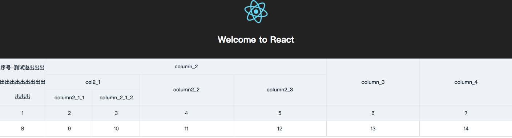

# FlexTable - React Table Component


## Feathers

- [Flow](https://flow.org) Based Type check
- [Creat-React-App](https://github.com/facebook/create-react-app) Based
- Multi-levels table header support
- custom rowSpan and colSpan for tbody


## Screenshot



## Todos

- columns fixed
- column sortable
- multiple custom styles with row and column

## Install

```
git clone git@github.com:bazingaedward/FlexTable.git
cd FlexTable
yarn install

// common commands
yarn flow // check source code types with Flow
yarn build-css // 在css目录下less编译css
yarn watch-css // 自动监测css变化并编译，建议新开一个terminal

```

## Usage

```
<FlexTable
  showHeader={true} //是否显示表头
  showBody={true} // 是否显示tbody
  columns={columns} // thead列数据，兼容element Table columns数据
  data={tableData} // tbody数据，兼容element Table data数据
  tableClass={'test-table'} // <table class="??">
/>
```

### Prop OPtions

|项目|说明|
|---|---|
|columns|表头列数据|
|data|body数据|
|showHeader|是否显示表头|
|showBody|是否显示table body|
|tableClass|设置 table class|
|rawTableData|body原生数据，如果与data同时设置，优先rawTableData渲染|
|maxHeight|table 最大高度像素|

### columns 数据示例

```
[
  {
  prop: 'col_1',
  label: '序号-测试溢出出出出出出出出出出出出出出出',
  width: 100,
  },
  {
    prop: 'col_2',
    label: 'column_2',
    subColumns: [
      {
        prop: 'col_2_1',
        label: 'col2_1',
        subColumns: [
          {
            prop: 'col_2_1_1',
            label: 'column2_1_1',
            minWidth: 100,
          },
          {
            prop: 'col_2_1_2',
            label: 'column_2_1_2',
            minWidth: 100,
          },
        ]
      },
      {
        prop: 'col_2_2',
        label: 'column2_2',
        minWidth: 200,
      },
      {
        prop: 'col_2_3',
        label: 'column2_3',
        minWidth: 200,
      },
    ],
  },
  {
    prop: 'col_3',
    label: 'column_3',
    minWidth: 200,
  },
  {
    prop: 'col_4',
    label: 'column_4',
    minWidth: 200,
  },
]
```

### data 数据示例

```
[
  {
    col_1: 1,
    col_2_1_1: 2,
    col_2_1_2: 3,
    col_2_2: 4,
    col_2_3: 5,
    col_3: 6,
    col_4: 7,
  },
  {
    col_1: 8,
    col_2_1_1: 9,
    col_2_1_2: 10,
    col_2_2: 11,
    col_2_3: 12,
    col_3: 13,
    col_4: 14,
  },
]
```

### rawTableData 数据示例

```
[
  [
    {
      label: 1,
      colSpan: 1,
      rowSpan: 2,
    },
    {
      label: 2,
      colSpan: 1,
      rowSpan: 1,
    },
    {
      label: 3,
      colSpan: 1,
      rowSpan: 1,
    },
    {
      label: 4,
      colSpan: 1,
      rowSpan: 1,
    },
    {
      label: 5,
      colSpan: 1,
      rowSpan: 2,
    },
    {
      label: 6,
      colSpan: 1,
      rowSpan: 1,
    },
    {
      label: 7,
      colSpan: 1,
      rowSpan: 1,
    },
  ],
  [
    {
      label: 8,
      colSpan: 1,
      rowSpan: 1,
    },
    {
      label: 9,
      colSpan: 1,
      rowSpan: 1,
    },
    {
      label: 10,
      colSpan: 1,
      rowSpan: 1,
    },
    {
      label: 11,
      colSpan: 1,
      rowSpan: 1,
    },
    {
      label: 12,
      colSpan: 1,
      rowSpan: 1,
    },
  ],
  [
    {
      label: 13,
      colSpan: 1,
      rowSpan: 1,
    },
    {
      label: 14,
      colSpan: 1,
      rowSpan: 1,
    },
    {
      label: 15,
      colSpan: 1,
      rowSpan: 1,
    },
    {
      label: 16,
      colSpan: 1,
      rowSpan: 1,
    },
    {
      label: 17,
      colSpan: 1,
      rowSpan: 1,
    },
    {
      label: 18,
      colSpan: 1,
      rowSpan: 1,
    },
    {
      label: 19,
      colSpan: 1,
      rowSpan: 1,
    },
  ],
]
```
